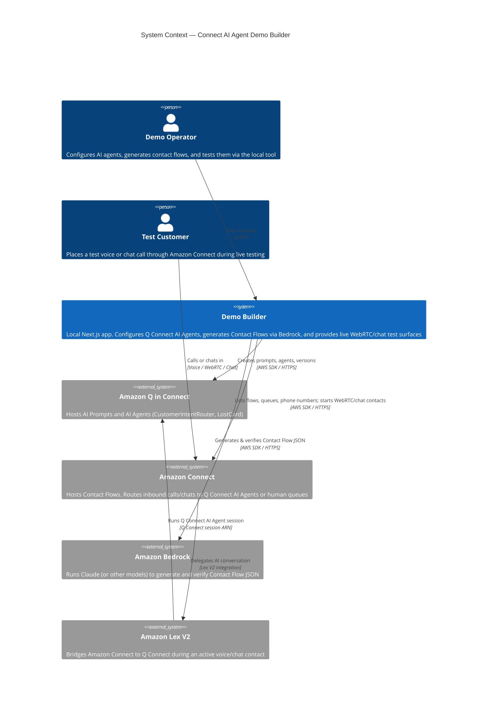
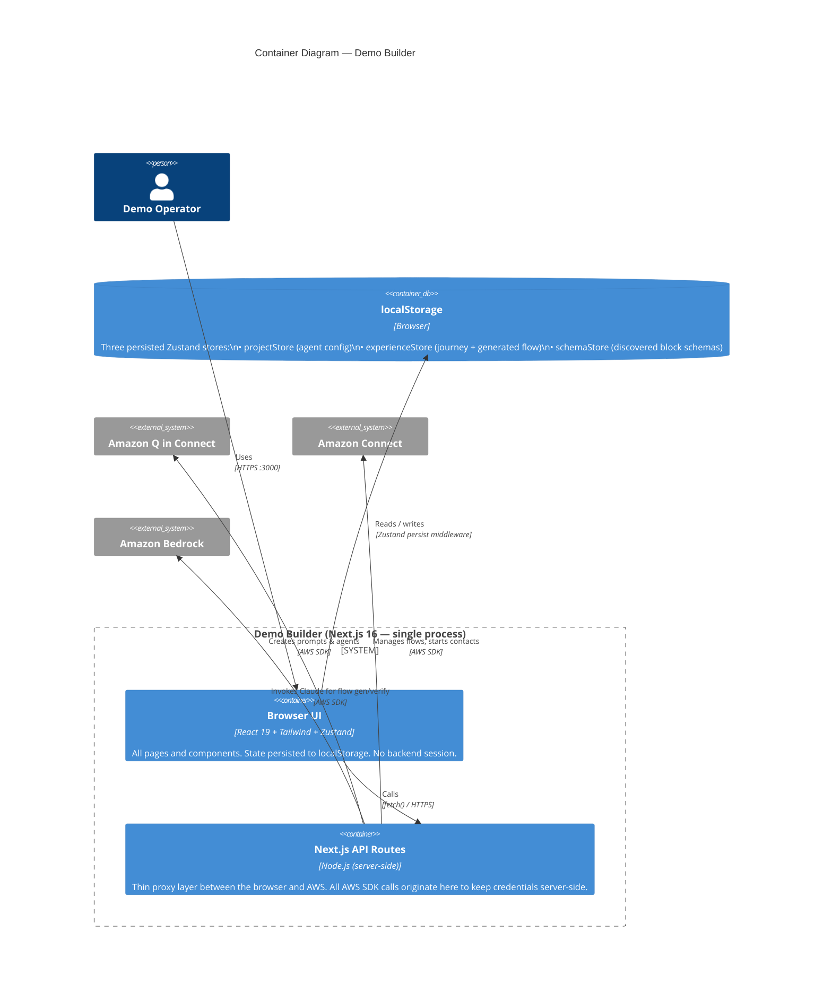
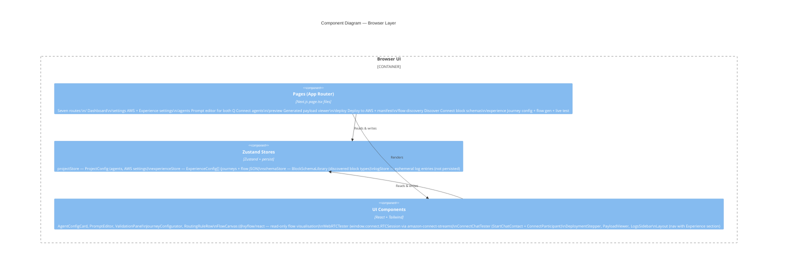
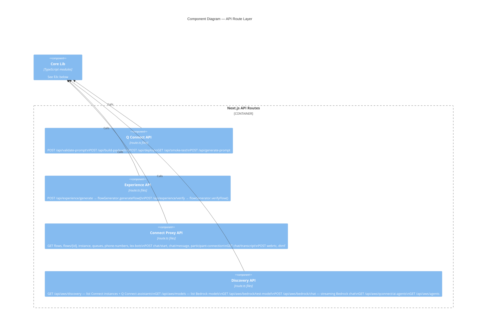
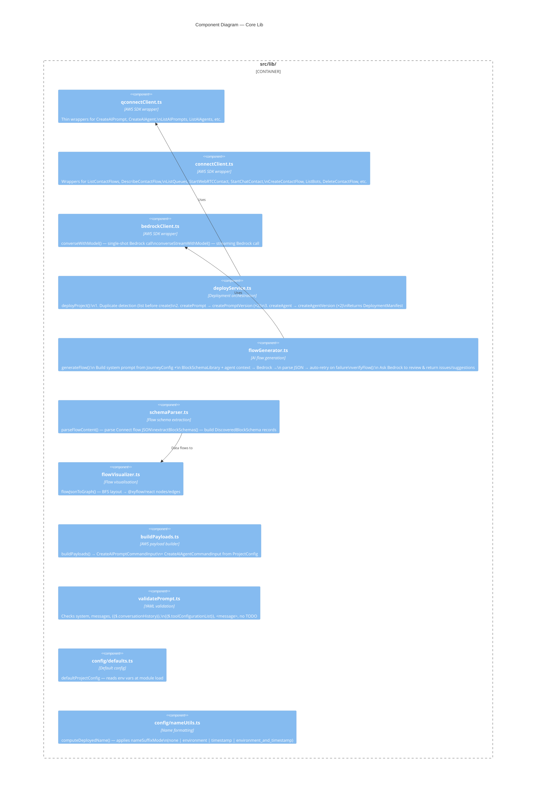

# Architecture Overview

This document describes the system architecture at C4 levels 1–3.

---

## Level 1 — System Context

Who uses the system and what external systems does it talk to.



---

## Level 2 — Containers

The major deployable/runnable units inside the Demo Builder.



---

## Level 3 — Components

### 3a — Browser Layer (React)



### 3b — API Route Layer (Server)



### 3c — Core Lib Layer



---

## Key Data Flows

### Flow 1 — Deploy Q Connect Agents

```
Operator clicks "Deploy to AWS"
  → Browser POST /api/deploy
    → deployService.deployProject()
      → qconnectClient.listAIPrompts()       [duplicate check]
      → qconnectClient.createAIPrompt()      [CustomerIntentRouter]
      → qconnectClient.createAIPromptVersion()
      → qconnectClient.createAIPrompt()      [LostCard]
      → qconnectClient.createAIPromptVersion()
      → qconnectClient.createAIAgent()       [CustomerIntentRouter, injects prompt version ID]
      → qconnectClient.createAIAgentVersion()
      → qconnectClient.createAIAgent()       [LostCard]
      → qconnectClient.createAIAgentVersion()
      → returns DeploymentManifest (IDs, ARNs, versions)
  → Browser stores manifest in projectStore
```

### Flow 2 — Generate Contact Flow (Experience Builder)

```
Operator configures JourneyConfig + selects Q Connect AI Agent
  → Browser POST /api/experience/generate
    → flowGenerator.generateFlow()
      → buildGenerationSystemPrompt()
          Injects: schemaLibrary + journeyConfig + agent ARNs + routing rules
          + agent system prompt (so Bedrock understands the agent's tools/signals)
      → bedrockClient.converseWithModel()    [Claude via Bedrock Converse API]
      → Parse JSON response
        if fail → one automatic retry with correction prompt
      → returns GenerationResult { flowJson, logs }
  → Browser stores flowJson in experienceStore
  → FlowCanvas renders via flowVisualizer.flowJsonToGraph()
```

### Flow 3 — Verify + Regenerate

```
Operator clicks "Verify"
  → Browser POST /api/experience/verify
    → flowGenerator.verifyFlow()
      → bedrockClient.converseWithModel()    [ask Bedrock to review the JSON]
      → parse { explanation, issues, suggestions }
  → Browser stores VerificationResult in experienceStore
  → Operator clicks "Regenerate with feedback"
    → same as Flow 2 but verificationFeedback is injected into the generation prompt
```

### Flow 4 — Schema Discovery

```
Operator opens /flow-discovery, clicks "Fetch Flows"
  → Browser GET /api/aws/connect/flows
    → connectClient.listContactFlows()
  → Operator selects a flow → GET /api/aws/connect/flows/[id]
    → connectClient.describeContactFlow()
  → Browser: schemaParser.parseFlowContent()
           → schemaParser.extractBlockSchemas()
           → schemaStore.mergeSchemas()       [persisted to localStorage]
```

### Flow 5 — Live WebRTC Test

```
Operator clicks "Start Voice Test" in /experience
  → WebRTCTester: Browser POST /api/aws/connect/webrtc
    → connectClient.startWebRTCContact()
    → returns { ContactId, ConnectionData }
  → WebRTCTester: window.connect.RTCSession(connectionData)
    [amazon-connect-streams loaded from public/connect-streams.js]
  → Two-way audio via WebRTC between operator browser and Connect
  → The active contact flow runs, invokes Lex → Q Connect AI Agent
```

---

## AWS Resource Dependencies

```
Amazon Connect instance
  └── Contact Flow (generated by Experience Builder)
        ├── Lex V2 Bot (bridges Connect ↔ Q Connect)
        └── Q Connect Assistant
              ├── AI Prompt: CustomerIntentRouter
              ├── AI Agent:  CustomerIntentRouter (references prompt version)
              ├── AI Prompt: LostCard
              └── AI Agent:  LostCard (references prompt version)

Amazon Bedrock
  └── Claude model (cross-region inference, us.* prefix)
        Used for: flow generation, flow verification, agent prompt generation
```
